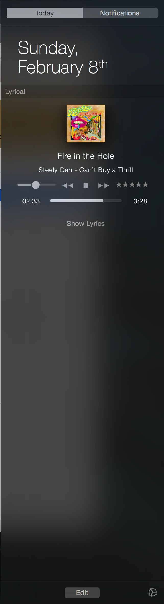
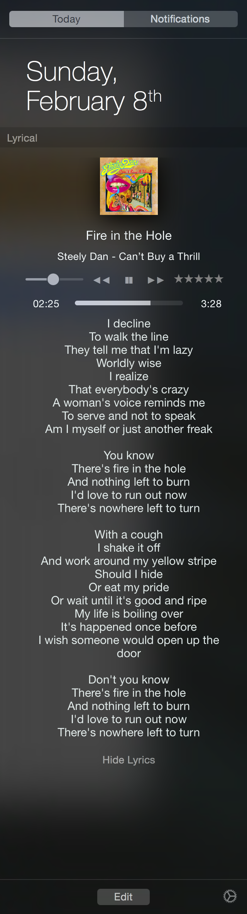

# Lyrical
Music.app lyrics and Playback controls inside Notification Center.

## Description

Lyrical is being fully open sourced, so others may use it as a reference, after
six years on the Mac App Store, since Swift's very first public release on the
Mac. I've lived through Swift's tough days for sure, and have more than a few
war stories, under my belt, as a result... ;)

Due to recent changes in the Widget framework and the deprecation of the Today
View, however, Lyrical's Today View extension is no longer viable as of macOS
11.0 (Big Sur), and so it was time to retire it from the Mac App Store.

Some parts still do work on macOS 11.0, such as the Last.fm scrobbling and the
integration with Big Sur's Music.app. Feel free to enter your own Last.fm API
keys in the appropriate files to enable functionality of this component. If
you're running a release older than macOS 11, Lyrical works as designed.

The initial Lyrical repository were purged and re-initialized to the one that
exists here, as so were the Xcode project and secret keys, as well as the
project and App Group IDs. However, these are relatively easy to set up once
again.

The project builds on Xcode 12, with Swift 5.3. It still has some crusty code
from Swift 1.0+ days though... :)

## Appearance

*Collapsed Look*

*Expanded Look*

## License

This work is licensed under the Mozilla Public License Version 2.0, see
[LICENSE](./LICENSE) for the full license text.
